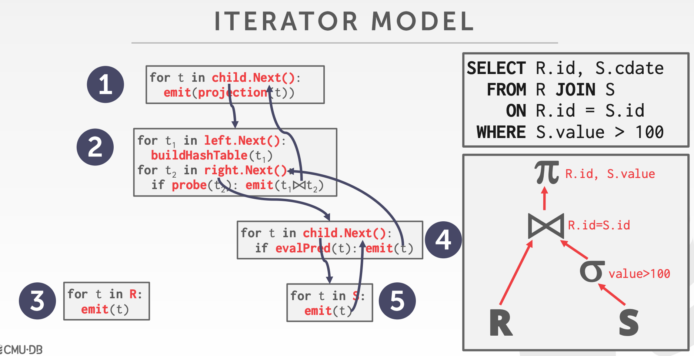
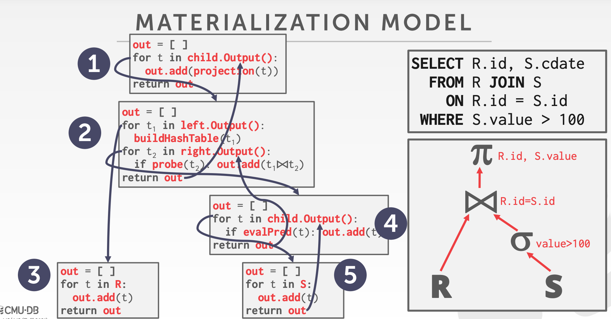
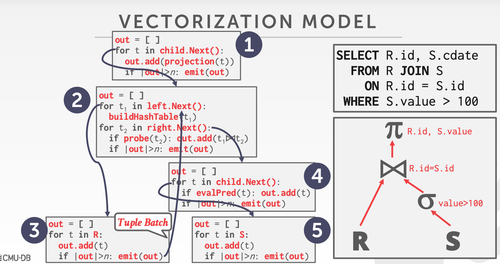

# Processing Model
How system executes a query plan.

## Iterator Model
Each query plan operator implements a `next()` function.  
Also called Volcano or Pipeline model.
- On each invocation, next return either single tuple or null marker if no more tuples.
- Loop calling next() on its children to retrieve tuple and process.

- used in almost all dbms, allows for tuple pipelining.
- some operator block until children emit all tuples: joins, subqueries, order by

## Materialization Model
Operator processes its input all at once and then emit output all at once.  
Hint(LIMIT) are pushed down to avoid scanning too many tuples.

- better for oltp, cause queries oly access small number of tuples at a time
  - lower execution/coordination over
  - fewer function calls
- not good for OLAP with large intermediate results

## Vectorization Model
Like iterator Model where each operator has next() function:
- each operator emits a batch of tuples instead of a single tuple
  - operator's internal loop processes multiple tuples at a time

- ideal for olap as reduces number of invocations per operator
- allows for easily use vectorized simd instruction

# Plan Processing Direction
- top-down
Start with the root and "pull" data up to root from children.  
Tuples are always passed with function calls.  
- down-top
Start with leaf nodes and push data to their parents.  
Allows for tighter control of caches/register in pipelines.  

# Access Methods
The way that dbms access the data stored in table.

## Sequential Scan
For each page in buffer pool, retrieve from buffer pool; Iterate over tuples;  
DBMS maintains an internal cursor that tracks last page/slot examined.  
Optimizations:
- Prefetching
- Buffer Pool Bypass(not store page in mem)
- Parallelization
- Heap Clustering
- Zone Maps
  - Pre-computed aggregates for attribute values in a page.
  - Checks zone map first to decide whether it wants access the page.
  - Min/Max/Avg etc. of the page values
- Late Materialization: DSM
  - Delay stitching together tuples until upper parts of the query plan.
## Index Scan
DBMS picks an index to find the tuples that query needs.
## Multi-index Scan
If multiple indexes that dbms can use for a query:
- compute sets of Record IDs using each matching index.
- combine these sets based on query predicates
- retrieve the records and apply any remaining predicates

# Modification Queries
Operators that modify the database are responsible for checking constraints and updating indexes.  
Halloween Problem.

# Expression Evaluation
Where clause as an expression tree, evaluations as a tree is slow;  
Consider JIT.
