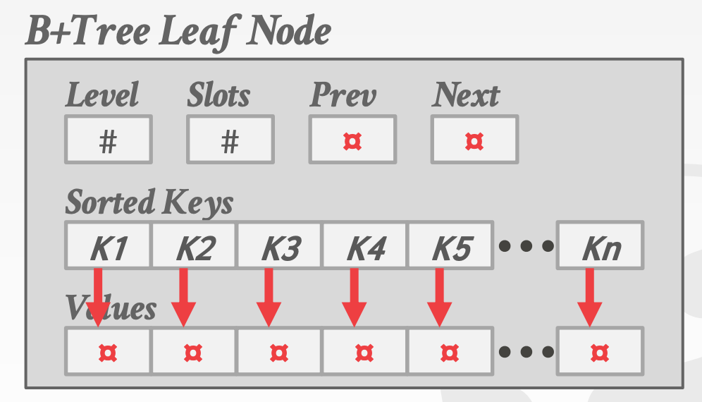

# Table Index
Replica of subset of table's attributes that are organized for efficient access.

## B tree
B+ tree is a self balanced tree that keeps data sorted and allows searches, sequentail access, insertions and deletions in O(log n).
- perfect balanced(same depth of node)
- every node other than root is half-full: `M/2 - 1 <= #keys <= M - 1`
- every inner node with k keys has k+1 non-null children

