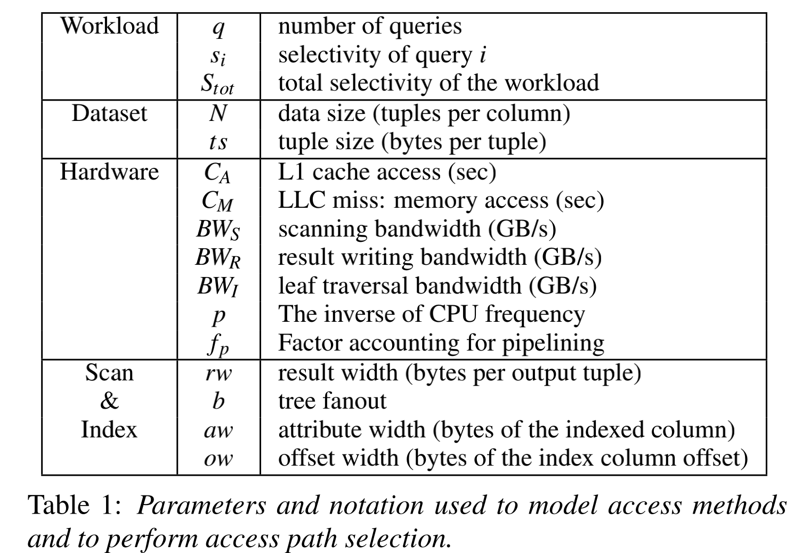

# Abstract
- compare modern sequential scans and secondary index scan
  - while scan become more useful in more cases than before, **both access paths are still useful**.
  - aps is still required to achieve the best performance
- take **query concurrency** into account in APS.

# Intro
## 回顾aps
- index: when query is predicted **on a clusted index**.
- sequential scan: when query is predicated on an attribute **with no index**.
- when query predicted on a column with a secondary index, secondary index scan may or may not work better than a full sequential scan.
- The decision of aps is typically based on a selectivity threshold, underlying hardware properties, system design parameters and data layout.
  - fixed for all queries.

## Modern analysis systems
column-group storage give more pressure on secondary indexing.
1. only attr needed by the query , avoiding unneeded reads in secondary index.
2. **vectorized execution** passes block of tuple to each operator.
    - processing block in tight loop, reducing interpretation logic overhead
3. share scan when system is processing more than one query across same attr.
    - cache friendly
4. compressing individual columns and working derectly over compressed data, reduces cost of moving data through memory hierarchy.
5. holding each attr **contiguously in a dense array** allows tight for loop evaluation and fits well to SIMD.

## aps in main-mem
Hot data can be memory resident due to large memories, questions need for secondary index.
- secondary index used to minimizing data movement from disk, no longer on the critical path.
- opt not to perform secondary index at all and focus on maximizing scan performance with clustered index and data skipping techniques.
- time for optimization takes limited time, and became new bottleneck.

# APS
## Model preliminatries
- Select Operator: filter out moust data in a query
  - Standard Select API
  - Input is column or column-group
- Query Workload: query number and query selectivity; Sum as total selectivity.
- Data Layout: shape and size of input data.
- Hardware: access time(cache or mem) and mem bandwidth.

## In-Mem Shared Scan
Tight `for` loop where tuple is in succession. Each attr is stored in dense arrays with fixed width elements,
such iteration over sequential memory is limited only by mem-bandwidth.
- Data Consumption Cost
  - Data Movement for Scan: $TD_s = frac{N · t_s}{BW_s}$ which is total data size divided by scan bandwitdh.
  - Predicate Evaluation: cost feed value to predication, $PE = 2·f_p·p·N$, where 2 is bound, f_p·p is cpu cost.
  - Cost calcu: Each query assigned to one hw thread even #query > #hw-thread.
  - So data consumption cost is Max(TD_s, PE)
- Result Writing: $TD_r = frac{N · rw}{BW_R}$ total result size divided by writing bandwidth.
- Cost Total
  - Cost for single query i is $Cost_singleqwr = \max(TD_s, PE) + s_i·TD_r$
  - Sharing Scan: 1) group queries based on attr 2) evaluate each query in batch;
    - allows data used by queries before evicted
    - Assume all queries start simutaneously, same data consumption cost.
    - CPU cost increased, so as output workload:
    - $Cost_tot = \max(TD_s, q·PE) + S_tot·TD_r$
