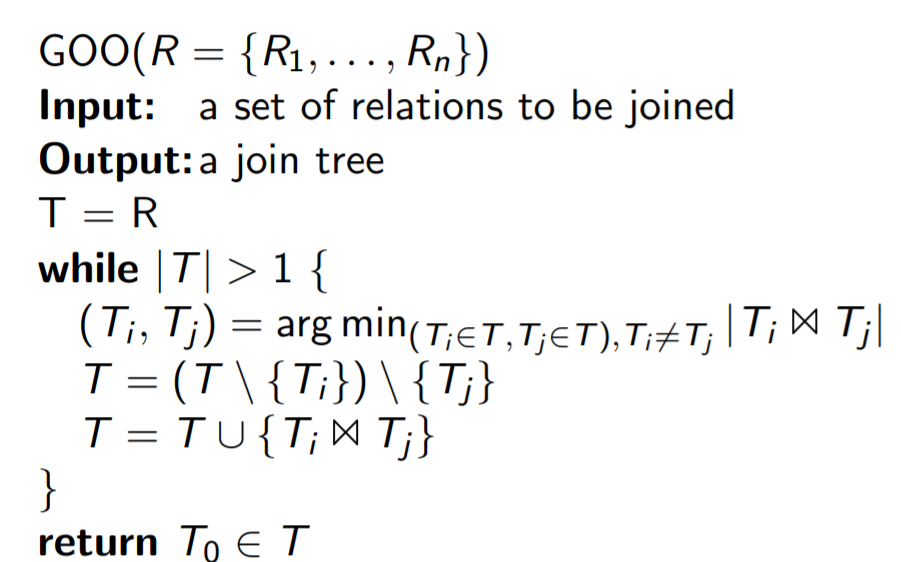

# GOO
Idea:
- all relation have to be joined somewhere
- but joins can also between whole join trees
- we therefore greedily combine join trees(which can be relations)
- combine join trees such that the intermediate result is minimal

